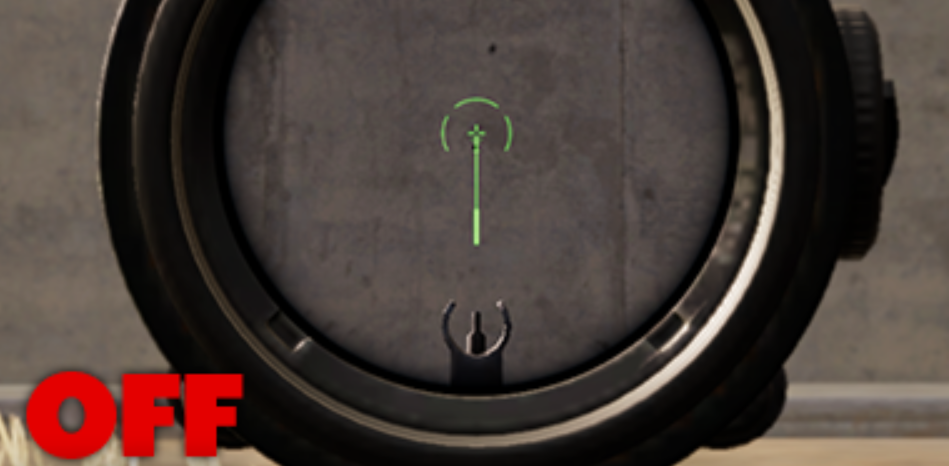
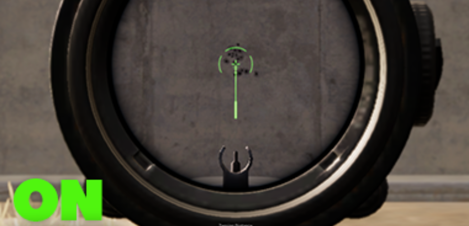

# 🎯 PUBG Logitech No Recoil Script


> **Take control of your aim!** This Logitech G Hub script **eliminates recoil** in PUBG, giving you a smoother shooting experience while staying fully customizable. 🎯🔥

---

## 📌 Table of Contents

- [✨ Features](#-features)
- [⚙️ Requirements](#-requirements)
- [🚀 Installation & Setup](#-installation--setup)
- [🎨 Customization Guide](#-customization-guide)
- [🎛️ Dynamic Recoil Adjustment (Simple Script)](#-dynamic-recoil-adjustment)
- [🛠️ Troubleshooting](#-troubleshooting)
- [📜 License](#-license)

---

## ✨ Features

✅ **Works with all Logitech G-Series Mice**  
✅ **Supports all weapons in PUBG** (AKM, M416, SCAR-L, etc.)  
✅ **Toggleable recoil compensation**  
✅ **Customizable sensitivity and key bindings**  
✅ **Optimized for Season 31**  
✅ **Safe & undetectable (uses Logitech G Hub scripting)**

<div align="center">
   
  
</div>

_Left: Without Script ❌ | Right: With Script ✅_

---

## ⚙️ Requirements

- **Logitech G-Series Mouse** 🖱️
- **Logitech G Hub Installed** 🔧 ([Download Here](https://www.logitechg.com/en-us/innovation/g-hub.html))
- **PUBG (PC Version)** 🎮
- **Windows OS** 💻

---

## 🚀 Installation & Setup

### 1️⃣ Install Logitech G Hub

- Download and install **[Logitech G Hub](https://www.logitechg.com/en-us/innovation/g-hub.html)**.
- Open G Hub and ensure your **mouse is detected**.

### 2️⃣ Download & Load the Script

- Get the **[PUBG-Logitech-No-Recoil.lua](https://github.com/Kava4/PUBG-LOGITECH-NO-RECOIL/blob/master/PUBG-Logitech-No-Recoil.lua)** script.
- Open **Logitech G Hub** → Click on your **PUBG profile**.
- Go to **Scripting** (bottom left) → Click **Create New Lua Script**.
- **Paste the script** into the editor and **Save**.

### 3️⃣ Assign the Script to a Button

- In **G Hub**, go to **Assignments → Macros**.
- Create a new macro and **assign it to a mouse button**.
- Make sure the script is linked to **PUBG’s profile**.

### 4️⃣ Test the Setup

- Launch **PUBG** and **press the assigned button** to enable the script.
- Fire a weapon to see the **no-recoil effect**!

---

## 🎨 Customization Guide

### 🔧 Adjusting Sensitivity

| Setting       | Description               | Default Value |
| ------------- | ------------------------- | ------------- |
| `SensSetting` | Recoil reduction strength | `1.0`         |

Modify in the script:

```lua
local SensSetting = 1.0  -- Adjust for different sensitivities
```

### 🖱️ Changing Key Bindings

Modify these values to set custom activation buttons:

```lua
local AKM = 4   -- Change to preferred button
local M416 = 5  -- Assign another weapon key
```

Find button IDs in **Logitech G Hub → Key Assignments**.

### 🎛️ Adjust Recoil Dynamically (For PUBG Script Users)

Increase or decrease recoil control while playing using **Logitech G Keys**:

```lua
if (event == "G_PRESSED" and arg == 8) then  -- G8 increases recoil control
    SensSetting = SensSetting + 0.05
    OutputLogMessage("Increased Recoil Compensation: " .. SensSetting .. "\n")
end

if (event == "G_PRESSED" and arg == 9) then  -- G9 decreases recoil control
    SensSetting = SensSetting - 0.05
    OutputLogMessage("Decreased Recoil Compensation: " .. SensSetting .. "\n")
end
```

🔹 Press **G8** to increase recoil control  
🔹 Press **G9** to decrease recoil control  
🔹 No need to restart the script! 🎯

💡 **Tip:** You can change `arg == 8` or `arg == 9` to any **G-key** on your Logitech keyboard/mouse. Just replace the number with your preferred keybinding.

---

## 🎛️ Dynamic Recoil Adjustment (Test Needed)

- Get the **[PUBG_Simple_NoRecoil_Adjustable.lua](https://github.com/Kava4/PUBG-LOGITECH-NO-RECOIL/blob/master/PUBG-Logitech-No-Recoil.lua)** script.
- Open **Logitech G Hub** → Click on your **PUBG profile**.
- Go to **Scripting** (bottom left) → Click **Create New Lua Script**.
- **Paste the script** into the editor and **Save**

---

This script allows you to **increase or decrease recoil compensation in real-time** using **Mouse Side Buttons 4 & 5**:

```lua
if (event == "MOUSE_BUTTON_PRESSED" and arg == 4) then  -- Side Button 1 (Increase recoil control)
    SensSetting = SensSetting + 0.05
    OutputLogMessage("Increased Recoil Compensation: " .. SensSetting .. "\n")
end

if (event == "MOUSE_BUTTON_PRESSED" and arg == 5) then  -- Side Button 2 (Decrease recoil control)
    SensSetting = SensSetting - 0.05
    OutputLogMessage("Decreased Recoil Compensation: " .. SensSetting .. "\n")
end
```

🔹 Press **Mouse Button 4** to increase recoil control  
🔹 Press **Mouse Button 5** to decrease recoil control  
🔹 No need to restart the script! 🎯

💡 **Tip:** You can change `arg == 4` or `arg == 5` to any **mouse button you prefer**. Just replace the number with your chosen keybinding.

---

## 🛠️ Troubleshooting

### ❌ Script Not Working?

🔹 Ensure **Logitech G Hub** is installed and running.  
🔹 Check if **Lua scripting is enabled** in G Hub.  
🔹 Assign the script to **PUBG’s profile**.  
🔹 Try **running G Hub as administrator**.

### 🎯 Recoil Feels Off?

🔹 Adjust the `SensSetting` value in the script:

```lua
local SensSetting = 1.0 -- Modify this based on your in-game sensitivity
```

🔹 Match **PUBG’s in-game sensitivity** settings.  
🔹 Test different **mouse DPI settings**.

### 🔄 Logitech G Hub Not Detecting the Script?

🔹 **Restart G Hub** and re-enable scripting.  
🔹 **Reinstall G Hub** if issues persist.  
🔹 **Delete & re-import** the script.

---

## 📜 License

🆓 **Open-source & free to use** – Provided as-is without warranties. Use responsibly!

---

💡 **Enjoy smooth aim and no recoil in PUBG!** 🎯🔥
